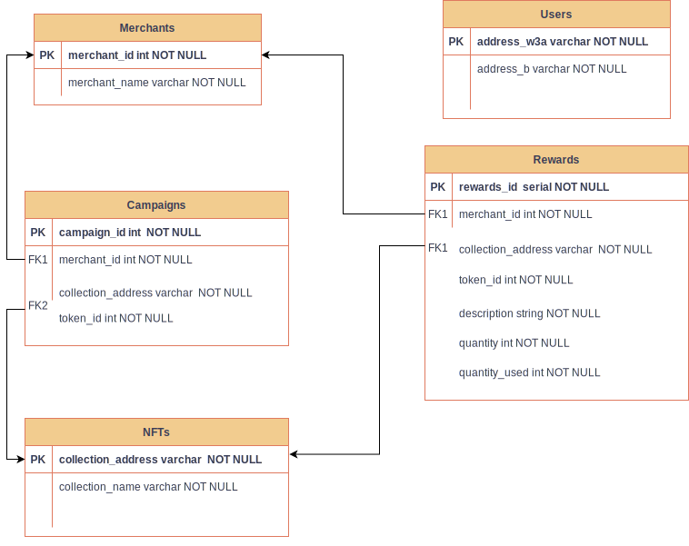
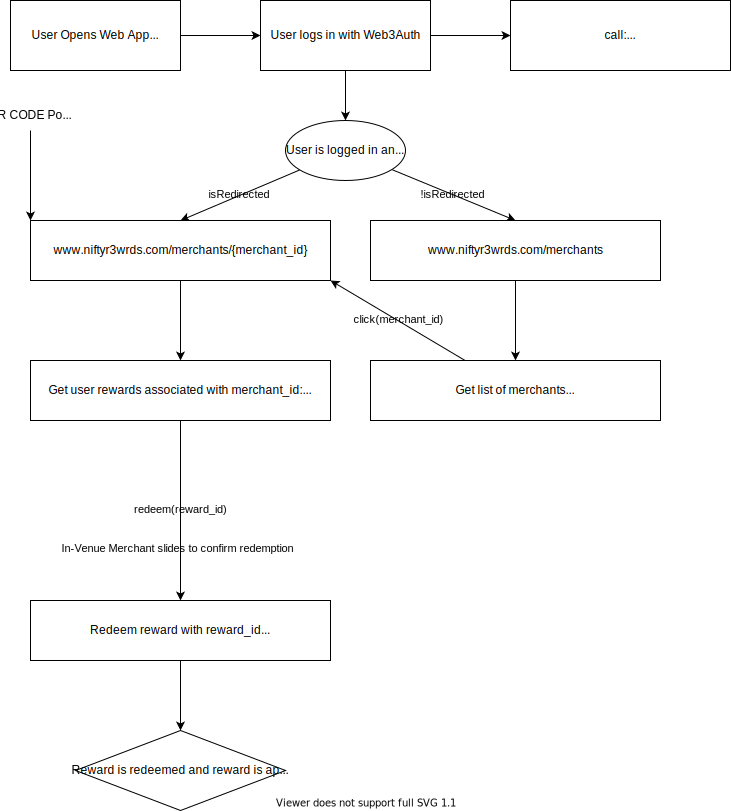
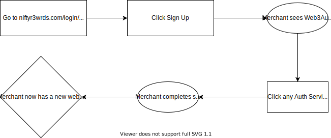

# NiftyRewards Server

Backend server created in Golang to provide an API interface for interaction with Database.

## Database Design



### Entities

Merchants (**merchant_id**, merchant_name)

NFTs (**collection_address**, collection_name, totalSupply)

Users (**address_w3a**, address_b)

<br/>

### Relationships

Campaign (**campaign_id**, _merchant_id_, _collection_address_, start_time, duration)

Rewards (**rewards_id**, _merchant_id_, _collection_address_, token_id, description, quantity, quantity_used, approved)

## Endpoints

### User

<br/>

[**POST**] ✅/users/bind/{address_w3a}/{address_to_bind}

Maps the web3Auth wallet address to a wallet that the user owns (one that is used to collect NFTS for example)

AUTH: Caller must be the owner of the account associated to address_w3a

Replaces current binded wallet with address_to_bind.

<br/>

[**GET**] /user/nfts/{address_w3a}

Gets all the NFTS

Returns a list of user’s NFTS in the wallet.

Data is populated from request to Tatum

<br/>

[**GET**] ✅/user/rewards/{merchant_id}

Gets all the rewards available filtered by the merchant_id

Returns a list of user’s NFTS in the wallet.

Data is populated from request to Tatum

[https://apidoc.tatum.io/#operation/NftGetTokensByAddressErc721]

[**PUT**] ✅/user/redeem/{rewards_id}
Redeems rewards based on rewards_id

Only owner of rewards_id can redeem

```txt
returns:
200: Success
400: User is not the owner of reward_id = {reward_id}
400: Reward Id does not exist
400: Reward has been fully redeemed
```

Reduce quantity by 1, quantity cannot fall below 0
Increase quantity_used by 1

<br/>
<br/>

### Merchant

[**GET**] /merchants

Get list of merchants.

```txt
returns:
merchants: Mechant[]
```

<br/>

[**POST**] /merchant/startcampaign

Request to start a campaign with a collection.

```txt

Reward {
  description: String
  quantity: Number
}

body:
collection_address: String
start_date: datetime
end_date: datetime
rewards: Reward[]

```

```txt
- Collection owner gets account address of the merchant
- Collection owner logs into the web app
- Collection owner goes to “approve merchant” page
- Collection owner inputs merchant address collected in step 1 & collection address
- Collection owner signs an typed sign with the merchant address and collection address
- Backend verifies if the collection owner is indeed the ownerOf collection address
- If ownerOf() Collection address is equals to the recovered address of the signature, the collection will be binded.
```

<br/>

[**GET**] /merchant/campaigns
Retrieves all campaigns that a merchant has

```txt
returns:
campaigns: Campaign[]
```

<br/>

[**POST**] /merchant/addrewards

Add a reward for the collection address.

Collection must be approved by collection owner.

```txt
body:
collection_address: String
description: String
```

<br/>
<br/>

### Collection Owner

[**POST**] /collectionowner/add

Adds collection to merchant. Only owner of collection can do this
The owner of the collection will be able to approve the merchant to use it to apply discounts. Approval can only happen after merchant has requested for a collaboration

```txt
body:
merchant_address: String
collection_address: String
signature: String

returns:
200: Successfully approved campaign
400: Signer is not the collection owner
400: Collection does not exist
400: Invalid Signature
400: No pending campaign
```

## User Flows

### User Account Registration (Existing NFT Holder)


### User Account Registration (New to NFTs)


### User Reward Redemption



### Merchant Account Registration



### Merchant - Start a Campaign


### Collection Owner - Approve a Campaign


## Sponsor Challenges

### Web3Auth

We are exclusively using Web3Auth as the main mode of login and authentication for our application. Using Web3Auth, we are able to allow users to easily on-board our platform with a crypto wallet, letting them directly have access to purchase NFTs that have loyalty rewards.

We improve the current system by creating a binding/mapping feature that binds existing wallets to the Web3Auth account. This is useful for users who already have NFTs in another wallet.
